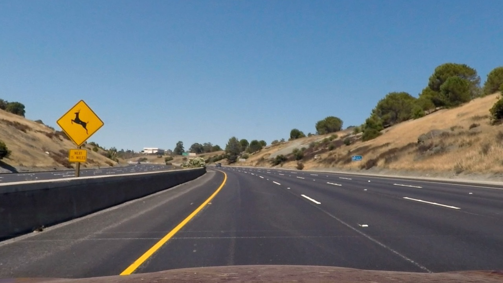
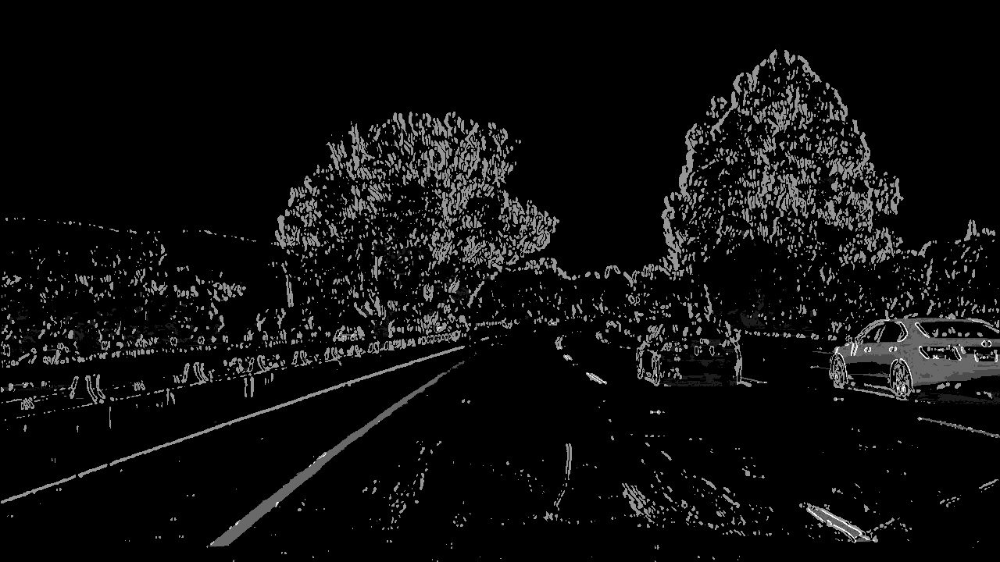
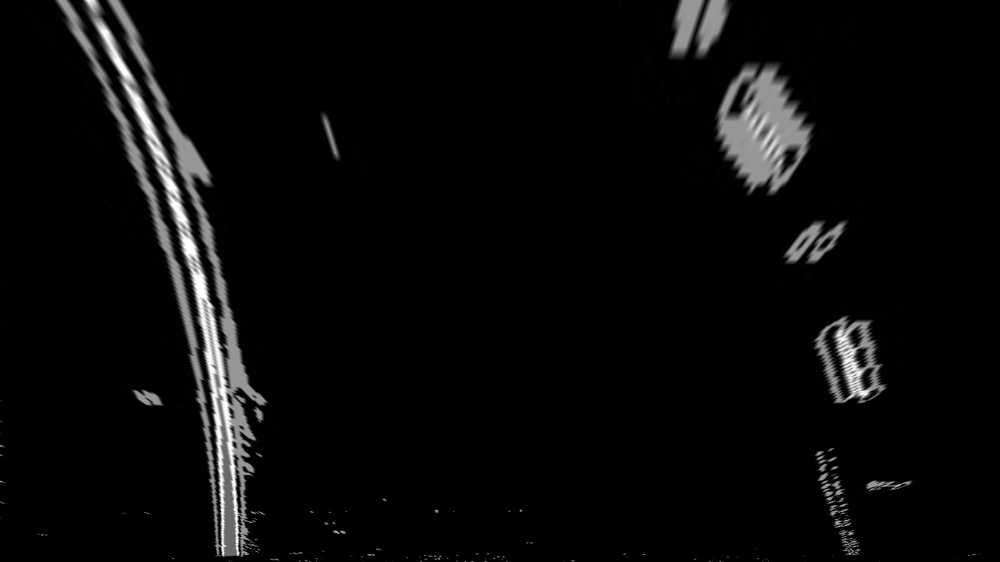
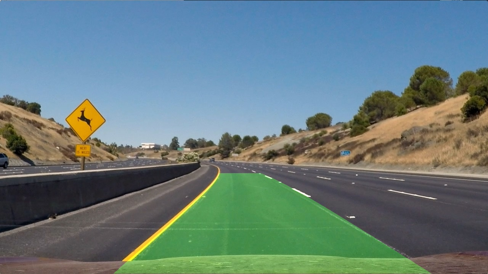
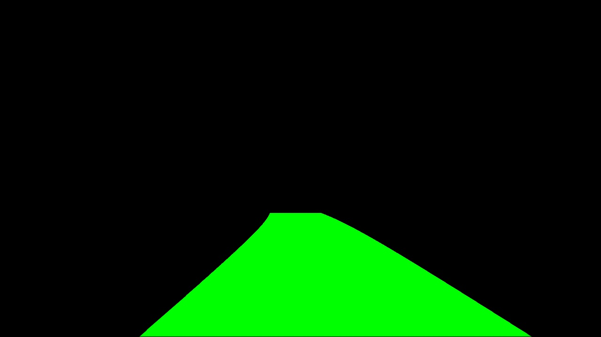
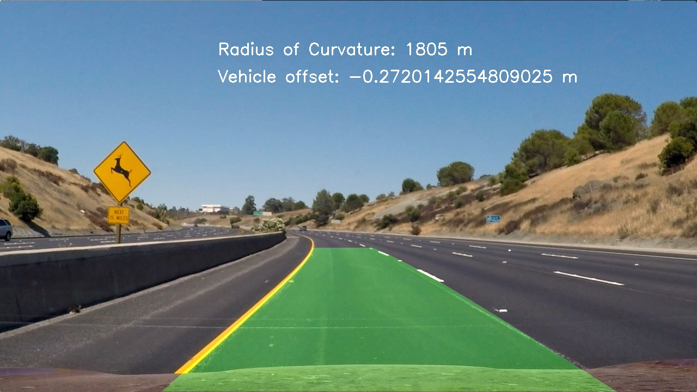

## Writeup Template

### You can use this file as a template for your writeup if you want to submit it as a markdown file, but feel free to use some other method and submit a pdf if you prefer.

---

**Advanced Lane Finding Project**

The goals / steps of this project are the following:

* Compute the camera calibration matrix and distortion coefficients given a set of chessboard images.
* Apply a distortion correction to raw images.
* Use color transforms, gradients, etc., to create a thresholded binary image.
* Apply a perspective transform to rectify binary image ("birds-eye view").
* Detect lane pixels and fit to find the lane boundary.
* Determine the curvature of the lane and vehicle position with respect to center.
* Warp the detected lane boundaries back onto the original image.
* Output visual display of the lane boundaries and numerical estimation of lane curvature and vehicle position.

[//]: # (Image References)

[image1]: ./examples/undistort_output.png "Undistorted"
[image2]: ./test_images/test1.jpg "Road Transformed"
[image3]: ./examples/binary_combo_example.jpg "Binary Example"
[image4]: ./examples/warped_straight_lines.jpg "Warp Example"
[image5]: ./examples/color_fit_lines.jpg "Fit Visual"
[image6]: ./examples/example_output.jpg "Output"
[video1]: ./project_video.mp4 "Video"

## [Rubric](https://review.udacity.com/#!/rubrics/571/view) Points

### Suggestions after first commit:
- Applying color threshold to the B(range:145-200 in LAB for shading & brightness changes and R in RGB in final pipeline can also help in detecting the yellow lanes.
  - And thresholding L (range: 215-255) of Luv for whites.
  - If perspective transform captures a very wide region of interest then it can bring noise. For single lane taking little wider region of interest will led in lesser noise in the warped binary images. Please don't shift the lane horizontally after using the perspective transform because this way your camera position get disturb from the center image and you can get an issues in calculating vehicle offset from center. Also you can check this link for more information:
      https://www.pyimagesearch.com/2014/08/25/4-point-opencv-getperspective-transform-example/
      http://www.ijser.org/researchpaper%5CA-Simple-Birds-Eye-View-Transformation-Technique.pdf
  - Check both the polynomials are correctly distanced with respect to the width of a lane.
  - Check the curvature of both polynomials whether it is similiar or not.
  - Also check the binary thresholding for improvement because mostly the detection is failing in shadows and brighter lane.
  - Also if there is an issue in a single frame then you can reject that wrong detection and reuse the confident detection from the previous detection. For smoothening the lane lines and for reducing wrong detection you can try averaging lane detection using a series of multiple frames.
  - In addition to other filtering mechanisms. You can also use cv2.matchShapes as a means to make sure the final warp polygon is of good quality. This can be done by comparing two shapes returning 0 index for identical shapes. You can use this to make sure that the polygon of your next frame is closer to what is expected and if not then can use the old polygon instead. This way you are faking it until a new frames appear and hence will get good results.


### How i reworked after fist commit
I thougt video was optional, therefore i didnt check my pipline for video for the first commit. After learning video was necessary to pass, i complete reworked my pipline. The first commit is not optimized for video. I left the first pipline as is, as it did work well for the images. The code can be found under "code.py"

The new pipline is saved under "code_video.py".

First step for rewriting the pipline is to get rid of all the foor loops I created to deal with all the individual rubric individually.
Now the pipline starts with the function "process_image" (line #411). From there I call all the other functions to analyse the image.

I reworked the "chanel_function" (line #90) so that it includes thresholding for Luv, Green and Sobel-Direction. The red treshhold was changed to a color threshold.

For the image transform i used different variables, aswell as for the region of interest funciton. The old variables are commented out.

Antoher significant change was to not always use the sliding window funciton but rather seach arround the already found polynomial (similar as it was shown in the course material). The function is called "search_around_poly" (line #260)

The "fit_polynomial" (line #316) function now checks for frame count and if there is an already existing polynomial. If the "search_around_poly" function returns empty values the sliding windows method is used again

```python
    if frame_count  == 0: #for the first frame always use sliding window
        leftx, lefty, rightx, righty, out_img = lane_finding(img)
        left_fit = np.polyfit(lefty, leftx, 2)
        right_fit = np.polyfit(righty, rightx, 2)
    elif frame_count != 0:
        leftx, lefty, rightx, righty, out_img = search_around_poly(img, left_fit, right_fit)
        left_fit = np.polyfit(lefty, leftx, 2)
        right_fit = np.polyfit(righty, rightx,  2)
        if left_fit == [] or right_fit == []: #if the method of search arround the polynomial doenst work use sliding window
            leftx, lefty, rightx, righty, out_img = lane_finding(img)
            left_fit = np.polyfit(lefty, leftx, 2)
            right_fit = np.polyfit(righty, rightx, 2)
```

To check the quality of the found polynomials and decide what method to use to find the polynomials multiple global variables are created, such as "frame_count".

To work in the suggestion from the Reviewer I check the found curves for similarty and for there distance. If either one of them is no sufficiant enough i discard the found curve and use the one from the frame before called "old_left_fit/old_right_fit".
```python
      # Check quality of the found curves
      # Check for similiarty
      similarty_check = cv2.matchShapes(left_fit, right_fit, 1,0.0)
      #print(similarty_check, 'similatty check')

      #check for distance between the linces
      line_distance = np.mean(right_fitx - left_fitx )
      #print(line_distance, 'line distance')

      #using old line, if quality isnt goot enough
      if frame_count != 0:
          #if line_distance > 620:
          if similarty_check > 0.2 or line_distance < 575 or line_distance > 625:
              left_fit = old_left_fit
              right_fit = old_right_fit
              #print('pingg alte linie')
```

To get smoother lines I average in the end over the last couple of frames. After checking different settings, i know average over 13 last frames.
```python
      #smoothing the line by avering ofer the last couple of frames
      right_average_range_x, right_fitx = averaging_lines(right_average_range_x, right_fitx)
      left_average_range_x, left_fitx = averaging_lines(left_average_range_x, left_fitx)
```

After all addjustment the lines are found in sufficiant quality in the test_video.

The processed video can be found under:
white.mp4


### Here I will consider the rubric points individually and describe how I addressed each point in my implementation.  

---

### Writeup / README

#### 1. Provide a Writeup / README that includes all the rubric points and how you addressed each one.  You can submit your writeup as markdown or pdf.  [Here](https://github.com/udacity/CarND-Advanced-Lane-Lines/blob/master/writeup_template.md) is a template writeup for this project you can use as a guide and a starting point.  

I tried to devide each single rubric in its own subtask by loading every rubric with its dedicated for loop. The goal was to work on each rubric indepenedelty spread over several weeks without going into the code of the rubric of the weeke before. As a pipeline this isnt very efficient, but for learning purposes with limited time per week this was the best way for me. Each Loop is checked by displaying and saving the image of the rubric. The displaying of the images is now commented out.

### Camera Calibration

#### 1. Briefly state how you computed the camera matrix and distortion coefficients. Provide an example of a distortion corrected calibration image.

All Code is in the file code.py. The file in sructured, that the Function that are being called are on the top an the solutions to the single rubric question are in the botton seperated by each question.

The Function to return the values needed to undistort an imagae is called camera_cal an is in line #11.
With the function cv2.findChessboardCorners and cv2. drawChessboardCorners and cv2.calibrateCamera the values are calculated.
Input is the chessboard image and the number of white and black fields.



### Pipeline (single images)

#### 1. Provide an example of a distortion-corrected image.

To demonstrate this step, I will describe how I apply the distortion correction to one of the test images like this one:
output_images/straight_lines2-undistort.jpg

In rubric2 I load all images from the folder images and iterate through them and apply the values from rubric1 with the function undistort_image (line #45). Input is the raw distorted image and values from the camera_cal function (line #11)

To undistort the image the cv2.undistort function ist used. The undistorted image is returned

In the pipline the undistorted image is saved in the folder output_images with its orginal name and the suffix "-undistort.jpg"


#### 2. Describe how (and identify where in your code) you used color transforms, gradients or other methods to create a thresholded binary image.  Provide an example of a binary image result.


Rubric3 was alot of trial an error to get an image that is showing the lane markings in high quality under all light and color conditions.
The Function for creating a threshold image starts at line #50. Input is the undistorted image, the lightness threshold for the hls color space, the saturation threshold for the hls colorspace, the sobel x and sobel y threshold, the red color threshold and the sobel kernel.

The values for the input can be adjusted in the pipiline under rubric 3.  

The resulting image is a combination of red-threshold, Sobel X threshold and the saturation threshold. The resulting image is saved in the folder output_images with its orginal name and the suffix "-Rubric3.jpg"




#### 3. Describe how (and identify where in your code) you performed a perspective transform and provide an example of a transformed image.

Rubric4 uses a function called perspective_transform (line #107). It takes the threshold image from Rubric3 as single input.
The Image is reduced to a region of interested with a function from project 1 called region_of_interest in line #88. This function cuts out all information were a lane line usualy is not expected. The trapeze corner is hard coded in the perspective_transform function. The corners are selected after alot of trial and error over the provided test images. With other test images the corners might need to be adjusted.

The acutal perspective transformation is using the cv2.getPerspectiveTransform function. The input for the function are src and dst points. Which are also hardcoded after several attempts to get it right. The dst-points are calculated using an offset of the input image size.

src = np.float32([[585, 455], [705, 455], [1130, 720], [190, 720]])
offset = 200
dst = np.float32([[offset, 0], [img_size[0]-offset, 0], [img_size[0]-offset, img_size[1]], [offset, img_size[1]]])


After testing if the transformation was sufficiant enough, the transformed images are saved in the folder output_images with its orginal name and the suffix "-Rubric4.jpg"




#### 4. Describe how (and identify where in your code) you identified lane-line pixels and fit their positions with a polynomial?

Rubric5 uses a function called fit_polynomial (line #212) which takes the takes the transformed image from Rubric4 as input. The Function calls another function called lane_finding (lane #129), which uses the sliding window method descriped in the course material. As hard input are the nuber of windows and the margin and the minimum amount of pixels found to recenter the window.

The function devides the image into two halfs, where lanes are normaly expected and Calculates the histogram to find a spike in detected pixels an centeres the first window arround it and the repeats it for the amount of windows defined. It returns the left and right lane pixels.

The fit_polynomial function uses the np.polyfit function to fit a curve through the returned pixels. To draw the function equally distributed points are generated.


#### 5. Describe how (and identify where in your code) you calculated the radius of curvature of the lane and the position of the vehicle with respect to center.

In Rubric6 I did not use a dedicated for loop to work on the rubric; because to many values from rubric5 are needed.

The function measure_curvature_real takes the found polynomial and its points as input (lane #243).  With a predefined conversion from pixel to meter (out of the course material) the radius of the lane line (left and right) is calculated.

The position of the vehicle is calculated by taking the middle between the curves and the middle of the image and subtract from each other.


#### 6. Provide an example image of your result plotted back down onto the road such that the lane area is identified clearly.

Rubric 7 and 8 are a little bit messy for understanding. In line #399 I save the results of Rubric6 into an array that is used later in Rubric8. This is a deviation from my plan to solve every Rubric in its own for loop.

Rubric7 i am wasn't sure what the result should look like, so I saved two possibilities:





### Discussion

#### 1. Briefly discuss any problems / issues you faced in your implementation of this project.  Where will your pipeline likely fail?  What could you do to make it more robust?

The desision to use a for loop for every rubric turned out to be a mistake which took a lot of effort and turned out to be only good for spreding out the work over several weeks but not to build a effective pipline.

My python skills are also lacking to write effective code.

Also excuse my english, i am writing this in ATOM which doenst support grammar correction.
